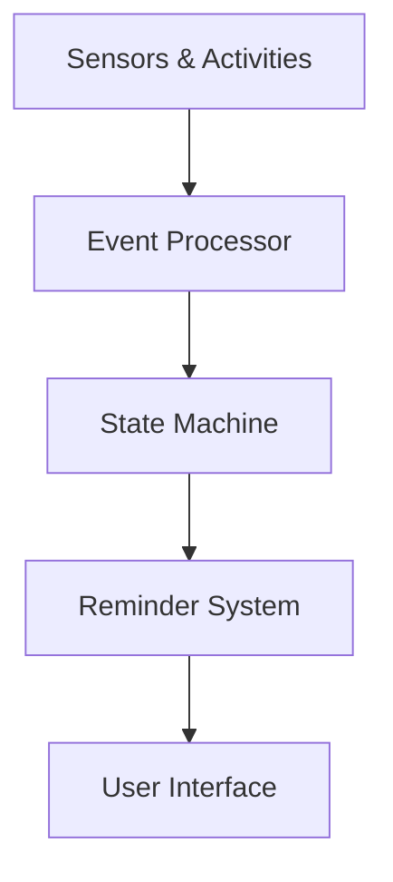

# Meal Prep Reminder System

## Overview
A context-aware kitchen assistant that integrates sensor data and activity recognition with LLMs to provide intelligent reminders.

## System Architecture

### Core Components

1. **Bot Service (LLM Backend)**
   - Natural language understanding
   - Code generation *engine*
   - Reminder scheduling system

2. **Event Processing**
   - Activity recognition handler
   - Sensor data processor
   - State machine executor

3. **Web Interface**
   - User authentication
   - Chat interface
   - Reminder management
   - Device connectivity (e.g., iPad)

### Data Flow


#### Reminder Creation and Processing Flow
1. **User Interaction**
   - User creates reminder through chat interface
   - Chat assistant gathers necessary information
   - Conversations are forwarded to summarization assistant

2. **Information Processing**
   - Summarization assistant structures the chat data
   - Extracts key fields: time, task, occurrences, recurrences
   - Scheduler processes timing-related information

3. **Code Generation and Validation**
   - Generated JSON sent to code generation LLM
   - Code is parsed and syntactically validated
   - Valid code stored in Datastore (JSON format)
   - Code analyzer (AST-based) identifies required sensors and activities

4. **Execution Flow**
   - Scheduler activates state machines during designated time windows
   - State machine executor filters incoming sensor/activity data
   - Handles both complete and partial pattern matches
   - Upon successful match:
     - State machine executes
     - Triggers notification system
     - Sends alerts to iPad via node server

## Prerequisites

### Software Requirements
- Node.js >= 14.x
- Python >= 3.8
- pipenv
- PostgreSQL >= 12
- Git
- npm >= 6.x or yarn >= 1.22
- React >= 18.2.0
- React Router DOM >= 6.23.1
- Material-UI >= 5.15.21
- React Native Web >= 0.19.10

### API Keys & Accounts
- OpenAI API key

## Setup Instructions

### 0. Environment Setup
```bash
# Copy example environment file
cp .env.example .env

# Configure your environment variables
# Required: OPENAI_API_KEY, GRPC_PORT, NODE_PORT, DB_CONNECTION
```

### 1. Bot Service Setup
```bash
# Navigate to bots directory
cd bots

# Install dependencies
pipenv install
pipenv shell

# Start server
uvicorn app:app --reload --port 4005

# Run tests
pytest tests/
```

### 2. GRPC Services
```bash
# Start GRPC server
cd bots
python grpc_server.py

# Start GRPC client
cd ../Middleware
python grpc_client.py
```

### 3. Web Application
```bash
cd server_node
npm install
npm start
```

### 4. AI Caring Interface Setup
```bash
# Navigate to webapp directory
cd Webapp/ai-caring-interface

# Install dependencies
npm install

# For production build
npm run build
npm run start
```

## Service Dependencies
Start services in the following order:
1. PostgreSQL Database
2. Bot Service (LLM Backend)
3. GRPC Server
4. Node.js Backend
5. AI Caring Interface

## Port Configuration
- Bot Service: 4005
- GRPC Server: 50051
- Node.js Backend: 7628
- AI Caring Interface: 3000

## Component Details

### Bot Service (`/bots`)
- **Core Files**
- `app.py` - FastAPI application
- `chat_assistant.py` - LLM integration
- `code_generation.py` - Reminder logic generation
- `util/scheduler.py` - Reminder scheduling

### GRPC Communication
- **Server Side**: `grpc_server.py`
  - Handles incoming sensor data
  - Activity recognition processing

- **Client Side**: `grpc_client.py`
  - Real-time data transmission
  - Connection management

### Web Backend (`/server_node`)
- Authentication service
- WebSocket management for iPad devices
- Reminder persistence

## Directory Structure
```
meal-prep-nu/
├── bots/                 # Core LLM and reminder logic
│   ├── chat_assistant/   # Chat processing
│   ├── code_generation/  # Reminder logic generation  
│   └── util/            # Utilities and scheduler
├── server_node/         # Web backend
├── webapp/              # Frontend applications
│   └── ai-caring-interface/  # React-based UI
├── Middleware/          # GRPC client and communication layer
└── Datastore/          # Data storage
```

## Configuration

### Environment Setup
```env
# .env file
OPENAI_API_KEY=<your-key>
GRPC_PORT=50051
NODE_PORT=7628
```

## Missing Components 
- A centralized database for reminders, providing a unified storage solution accessible to both the Node.js backend and the state machine. This would enable reminders to be logged and viewed seamlessly within the web interface for reminder history.
- An enhanced prompt or dedicated LLM layer that evaluates the feasibility of reminders by checking sensor availability and activity requirements, offering users immediate feedback when certain reminders are not currently supported.